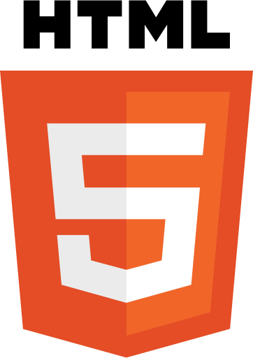
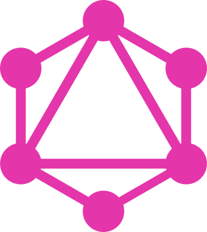

# Project: Virtual Shop
This is the frontend of a virtual shop project. There is <b>no</b> actual transaction involving real money.

[The website of this project]() 
[The backend of this project]()

## This project features:
[Features implemented in past projects]() are omitted for brevity.
<ul>
    <li>more advanced React features: hooks, ref, portal</li>
    <li>more refined responsive design (3-phrases)</li>
    <li>drag & drop events</li>
    <li>async request to server</li>
</ul>

# Techs used

    
Programming languages & frameworks

## some technical background

design choice

<ul>
<li>
    In the last project I used JavaScript for React, but there was numerous issues such as lack of 
    enum, and unpredictable behaviour in function parameter. Therefore, I use TypeScript for this project.
    I place focus on simplicity and clarity of structure, and do not aim to provide the most feature in this project.
</li>
<li>
    I used more functional component and hook than the previous project. React does not really have inheritance so class method
    is not reusable across component. Hooks however can.
</li>
<li>
    The drag drop event 
</li>
<li>
</li>
</ul>

